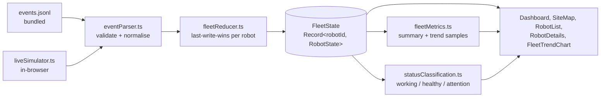

# Fleet Console

An operator dashboard for monitoring a fleet of eight robots moving around a
warehouse site. Built for the Peppermint Robotics SDE-1 hiring challenge
(frontend assignment).

The operator can watch the recorded 15-minute event log at up to 20x speed,
switch to a continuously-generated live feed, see where every robot is on the
site map, track how the fleet composition trends over time, and drill into any
robot that needs attention.

**Live demo:** https://rockstar100.github.io/fleet-dashboard/

---

## Architecture



Both event sources - the recorded log and the live simulator - are just
producers of `FleetEvent[]`. They call the same `dispatch` on the same
`useReducer`, so there is exactly one place where fleet state is mutated and
one state shape the whole UI reads from.

| Layer | File | Responsibility |
| --- | --- | --- |
| Config | `src/lib/config.ts` | Every tunable number (site size, speeds, live-feed rates, thresholds) |
| Parse | `src/lib/eventParser.ts` | Untrusted record → validated `FleetEvent`; clamps coords/battery, rejects bad status |
| State | `src/lib/fleetReducer.ts` | `(FleetState, FleetEvent[]) => FleetState`, pure, last-write-wins per robot by `t` |
| Classify | `src/lib/statusClassification.ts` | The one definition of "working" vs "needs attention" |
| Metrics | `src/lib/fleetMetrics.ts` | Summary counts + the appended trend series |
| Replay timing | `src/lib/replayClock.ts` | Pure helpers: bucket events by `t`, pick events for a time slice |
| Live feed | `src/lib/liveSimulator.ts` | Generates plausible ongoing telemetry |
| Filtering | `src/lib/filterRobots.ts` | Search / status / attention filter + list sort |
| Orchestration | `src/hooks/useFleetController.ts` | Owns the reducer, the mode switch, wires replay + live |
| | `src/hooks/useReplay.ts` | `requestAnimationFrame` loop + virtual clock |
| | `src/hooks/useLiveFeed.ts` | `setInterval` tick → parse → dispatch |
| | `src/hooks/useFleetMetrics.ts` | Accumulates the trend series as state advances |
| UI | `src/components/**` | Presentation only - no event logic |

---

## Tech stack

| Choice | Why |
| --- | --- |
| React 18 + TypeScript | Standard, strongly-typed component model. `strict` + `noUncheckedIndexedAccess` on. |
| Vite | Fast dev server, trivial static build, `?raw` import for the event log. |
| Tailwind CSS | Utility styling keeps the dark industrial theme consistent without a component library. Status colours are centralised in `statusVisuals.ts`, not scattered in markup. |
| Recharts | The one real dependency. A small declarative charting API for the fleet-trend `ComposedChart`. ~150 kB gzipped, isolated in its own build chunk - see Tradeoffs. |
| `useReducer` + hooks, no Redux/Zustand | One reducer and one controller hook is enough for a single-fleet dashboard. |
| Vitest + Testing Library | Same transform pipeline as the app; fast. |

---

## Running locally

Requires Node 20+.

```bash
npm install

npm run dev        # dev server at http://localhost:5173
npm test           # run the unit + smoke tests once
npm run test:watch # watch mode
npm run lint       # eslint, zero warnings allowed
npm run typecheck  # tsc, no emit
npm run build      # production build to dist/
npm run preview    # serve the built dist/ locally
```

---

## Features

**Site & fleet visualisation** (`SiteMap.tsx`, `RobotMarker.tsx`)

- `layout.png` as the site map; all 8 robots overlaid at once.
- Coordinates map cleanly: the map box is locked to the image's native
  900x560 aspect ratio and each marker is placed at `x/900` and `y/560` as a
  percentage - no resize listeners, alignment survives any screen size.
- Status shown by colour (legend below the map) + label; selected robot gets a
  teal border chip and raised z-index; attention robots get a small red
  corner badge (independent of selection — selected+attention stays teal-
  bordered with the red badge, not a red ring).
- Filtered-out robots dim to 28% rather than disappearing, so the map stays a
  faithful picture of the site.
- Click a marker (or a list row) to select; click empty map (including the
  layout image) to deselect.

**Replay mode** (`useReplay.ts`, `replayClock.ts`, `PlaybackControls.tsx`)

- Play / pause / restart, 1x / 2x / 5x / 10x / 20x speed, `mm:ss` clock,
  scrubbable progress bar.
- Events are bucketed by `t`; each animation frame the virtual clock advances
  by `dt * speed` and every bucket in the `(previous, now]` interval is
  dispatched. Scrubbing backwards replays from zero (state is not
  time-indexed); scrubbing forward fast-forwards.

**Live mode** (`liveSimulator.ts`, `useLiveFeed.ts`)

- Not a re-run of the log. On switch it seeds from the current on-screen
  positions, then generates fresh telemetry:
  - movement - each robot carries a heading, walks a bounded step
    (≤ 14 units/tick) and slowly turns; reflects off the site edges.
  - battery - drains while mobile/faulted, charges while `charging`,
    trickles down while idle; clamped to 0-100.
  - status - a small transition table: robots wander
    `idle <-> active <-> on_mission` with occasional faults; a robot at ≤ 20%
    battery routes to `charging` and climbs back out.
- Rate: one update per robot per tick, tick = 1000 ms => ~8 events/second.
  Tunable in `config.ts` (`LIVE.tickMs`, `LIVE.secondsPerTick`).
- Runs through the identical `eventParser` -> `dispatch` path as replay.

**Fleet-level trend** (`FleetTrendChart.tsx`, `useFleetMetrics.ts`)

- A stacked area chart of robot count by operational class over time
  (working / healthy / attention) with average battery on a second axis.
- `useFleetMetrics` appends one sample per distinct timeline `t`, de-duped and
  capped at 240 points (a rolling window in live mode).

**Discovery & attention workflow** (`filterRobots.ts`, `RobotList.tsx`, `RobotDetails.tsx`)

- Search by robot ID or type, filter by status, "attention only" toggle with a
  live count.
- List is sorted attention-first, then lowest battery.
- Detail panel: ID, type, status, operational class, battery gauge, position,
  event/feed time, last update age, updates applied, attention reason, and the
  last `task_event` if one was seen.

---

## Important design decisions

1. **One reducer, two producers.** `useFleetController` holds a single
   `useReducer(fleetReducer)`. `useReplay` and `useLiveFeed` both emit
   `FleetEvent[]` into its `dispatch`. There is no separate "live state" -
   which is the only way the map, list, details and chart can be guaranteed
   consistent regardless of source.

2. **State keyed by robot, last-write-wins by `t`.** `FleetState.robots` is
   `Record<robotId, RobotState>`. `fleetReducer` drops any event whose `t` is
   older than what a robot already has, so a late or replayed packet cannot
   rewind a robot.

3. **`rebase` action for mode switches.** Switching replay <-> live dispatches
   `{ type: 'rebase' }`, which keeps every robot where it currently is on the
   map but rewinds `lastEventT` to `-1` and `clockT` to `0`, so the incoming
   source's `t` sequence isn't rejected as stale.

4. **Classification centralised.** `statusClassification.ts` is the only file
   that knows what a status means. `statusVisuals.ts` is the only file that
   knows what it looks like.

5. **Percentage-based map overlay.** No `getBoundingClientRect`, no canvas, no
   resize observer for positioning. The aspect-locked box + percentage
   coordinates make responsiveness free and keep markers pixel-accurate.

6. **Pure timing helpers.** The fiddly "which events fire this frame" logic is
   in `replayClock.ts` as pure functions so it is unit-tested directly; the
   hook only owns the `requestAnimationFrame` loop.

7. **Data bundled, not fetched.** `robots.json` and `events.jsonl` are
   imported at build time. The deployment is one static artifact - no fetch,
   CORS, or backend.

8. **Mode switching is guarded against stale-callback races.** `useReplay`'s
   `requestAnimationFrame` loop and `useLiveFeed`'s interval each mirror their
   `enabled` prop into a ref, updated synchronously during render. The
   scheduled callback checks that ref before it dispatches or reschedules, so
   a frame/tick already in flight when the operator switches modes can't land
   a stale event in the new mode's state - it doesn't rely solely on
   `cancelAnimationFrame`/`clearInterval` timing, which React does not
   guarantee runs before the next queued browser callback. Covered by
   `src/tests/modeSwitchRace.test.ts`, which stubs those cancellation APIs as
   no-ops to prove the guard, not the cancellation, is what stops the stale
   dispatch.

9. **Replay jumps (scrub, restart) suppress the marker glide.** A big seek
   dispatches its events in one batch, so the state update itself is correct
   and atomic - but animating `left`/`top` over 240ms would still show a robot
   visibly sliding across the map to its new spot. `useReplay` exposes a
   `motionToken` bumped on every restart/seek; `useInstantAfter` (a small
   "does this differ from what was last committed" hook) turns that into one
   render with the CSS transition switched off, so the marker snaps instead.
   Live mode never sets this - continuous small movement should stay animated.

---

## Status classification

Defined in `src/lib/statusClassification.ts`.

| Class | Statuses | Reasoning |
| --- | --- | --- |
| Working | `active`, `on_mission` | Robot is doing useful work right now. |
| Healthy | `idle`, `charging` | Fine, just not producing. `charging` is intentional downtime, not a fault. |
| Needs attention | `blocked`, `error`, `maintenance`, `offline` | Stuck, needs a human, or telemetry is lost. |
| Needs attention (derived) | battery ≤ 20% while not charging; or no telemetry for > 15 s (live mode only) | Low battery is a leading indicator; staleness only applies in live mode. |

`attention` always wins over `working`/`healthy`. Thresholds live in
`config.ts` (`ATTENTION.lowBatteryPct`, `ATTENTION.staleAfterMs`).

---

## Tradeoffs

- **Recharts (~150 kB gzipped) vs a hand-rolled SVG chart.** Saved a few
  hours of SVG plumbing at the cost of most of the JS bundle. Isolated in its
  own build chunk (`vite.config.ts` `manualChunks`); `FleetTrendChart.tsx` is
  the only file that imports it.
- **Scrub-backwards replays from zero.** Fleet state is not indexed by time,
  so seeking to an earlier point resets and fast-forwards. Cheap and simple
  for a 15-minute window.
- **Live feed in the browser, not a server.** The challenge allows falling
  back to browser generation. It removes a deploy target and a cold-start
  failure mode; the cost is that reconnect/backpressure behaviour is
  described in `SYSTEM_DESIGN.md` rather than demonstrated.

---

## Known limitations

- Scrubbing backwards is not instant (replays from 0).
- Live status transitions are stochastic, not physically modelled; robots
  don't avoid drawn obstacles, only the outer bounds.
- No persistence - reloading restarts replay and clears live history.
- Trend series is capped at 240 points (a rolling ~20-minute window in a long
  live session).
- Stale-telemetry attention is implemented and tested, but the in-browser live
  simulator updates every robot every tick, so a single-robot stall is not
  observable unless the feed itself stops. A real socket feed would surface it.
- One breakpoint - usable on a tablet but designed for a desktop station.

## What I would build next

1. Time-indexed replay snapshots so the scrubber is instant in both
   directions.
2. Per-robot history sparklines in the detail panel.
3. A real live-feed server, with the browser generator kept as the offline
   fallback.
4. Alert log / toast when a robot first enters an attention state.
5. Configurable classification exposed as a settings panel.

---

## Tests

`npm test` - run with Vitest.

| File | Covers |
| --- | --- |
| `fleetReducer.test.ts` | apply, stale/out-of-order rejection, same-timestamp order, unknown robot, `rebase` semantics |
| `replayClock.test.ts` | bucketing, half-open `(from, to]` windowing, no double-emit, progress clamp |
| `liveSimulator.test.ts` | one valid event/robot/tick, bounds + battery + status stay valid over 500 ticks, low-battery -> charging |
| `statusClassification.test.ts` | working/healthy/attention buckets, low-battery rule, staleness, reason strings |
| `eventParser.test.ts` | good record, bad status, NaN/missing fields, clamping, malformed JSONL lines |
| `fleetMetrics.test.ts` | summary counts, `pushSample` de-dupe + cap, sample timestamping |
| `filterRobots.test.ts` | search (id/type/case), status + attention filters, AND combos, attention-first sort |
| `useFleetMetrics.test.ts` | trend sampling is atomic per dispatch batch (never a partial fleet), series resets on `resetKey` change |
| `useReplay.test.ts` | `motionToken` bumps on restart/every seek, not on plain play/pause |
| `modeSwitchRace.test.ts` | a rAF frame / interval tick already in flight when the mode switches away does not dispatch, even with `cancelAnimationFrame`/`clearInterval` stubbed as no-ops |
| `robotDetails.layoutStability.test.tsx` | reserved status-region height for healthy vs attention; empty-state min-height |
| `dashboard.smoke.test.tsx` | Dashboard mounts, 8 robots render, transport controls present, map/list/details selection sync + empty-map deselect |

---

## AI use

I used an AI assistant for scaffolding boilerplate, drafting docs, and
flagging a couple of edge cases (a paused-replay staleness bug, replay-window
boundaries) during review. The architecture, state flow, and classification
policy are mine, and I can walk through and modify any part of this codebase.
