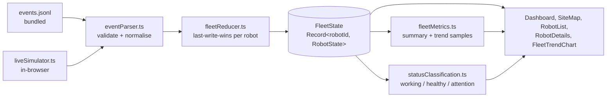

# Fleet Console

An operator dashboard for monitoring a fleet of eight robots moving around a
warehouse site. Built for the Peppermint Robotics SDE-1 hiring challenge
(frontend assignment).

The operator can watch the recorded 15-minute event log at up to 20× speed,
switch to a continuously-generated **live feed**, see where every robot is on the
site map, track how the fleet composition trends over time, and drill into any
robot that needs attention.

**Live demo:** https://rockstar100.github.io/fleet-dashboard/
The live feed is generated entirely in the browser, so the deployed link is a
plain static site with no backend to wake up.

---

## Architecture



Both event sources — the recorded log and the live simulator — are just
producers of `FleetEvent[]`. They call the **same** `dispatch` on the **same**
`useReducer`, so there is exactly one place where fleet state is mutated and one
state shape the whole UI reads from.

| Layer | File | Responsibility |
| --- | --- | --- |
| Config | `src/lib/config.ts` | Every tunable number (site size, speeds, live-feed rates, thresholds) |
| Parse | `src/lib/eventParser.ts` | Untrusted record → validated `FleetEvent`; clamps coords/battery, rejects bad status |
| State | `src/lib/fleetReducer.ts` | `(FleetState, FleetEvent[]) => FleetState`, pure, last-write-wins per robot by `t` |
| Classify | `src/lib/statusClassification.ts` | The one definition of "working" vs "needs attention" |
| Metrics | `src/lib/fleetMetrics.ts` | Summary counts + the appended trend series |
| Replay timing | `src/lib/replayClock.ts` | Pure helpers: bucket events by `t`, pick events for a time slice |
| Live feed | `src/lib/liveSimulator.ts` | Generates plausible ongoing telemetry |
| Filtering | `src/lib/filterRobots.ts` | Search / status / attention filter + list sort |
| Orchestration | `src/hooks/useFleetController.ts` | Owns the reducer, the mode switch, wires replay + live |
| | `src/hooks/useReplay.ts` | `requestAnimationFrame` loop + virtual clock |
| | `src/hooks/useLiveFeed.ts` | `setInterval` tick → parse → dispatch |
| | `src/hooks/useFleetMetrics.ts` | Accumulates the trend series as state advances |
| UI | `src/components/**` | Presentation only — no event logic |

---

## Tech stack

| Choice | Why |
| --- | --- |
| **React 18 + TypeScript** | Standard, strongly-typed component model. `strict` + `noUncheckedIndexedAccess` on. |
| **Vite** | Fast dev server, trivial static build, `?raw` import for the event log. |
| **Tailwind CSS** | Utility styling keeps the dark industrial theme consistent without a component library. Status colours are centralised in `statusVisuals.ts`, not scattered in markup. |
| **Recharts** | The one real dependency. A small declarative charting API for the fleet-trend `ComposedChart`. It is ~150 kB gzipped and lives in its own build chunk — see [Tradeoffs](#tradeoffs). |
| **`useReducer` + hooks, no Redux/Zustand** | One reducer and one controller hook is enough for a single-fleet dashboard. A global store would be ceremony without payoff here. |
| **Vitest + Testing Library** | Same transform pipeline as the app; fast. |

---

## Running locally

Requires Node 20+.

```bash
npm install

npm run dev        # dev server at http://localhost:5173
npm test           # run the unit + smoke tests once
npm run test:watch # watch mode
npm run lint       # eslint, zero warnings allowed
npm run typecheck  # tsc, no emit
npm run build      # production build to dist/
npm run preview    # serve the built dist/ locally
```

### Deploying

The build output in `dist/` is a self-contained static site (`base: './'` in
`vite.config.ts`, so it works from a sub-path too).

- **Netlify / Vercel:** point at the repo, build command `npm run build`,
  publish directory `dist`. `netlify.toml` is included.
- **GitHub Pages:** `.github/workflows/deploy.yml` builds, lints, tests and
  publishes on push to `main` (enable Pages → "GitHub Actions" in repo settings).
- **Anywhere:** `npm run build` and upload `dist/`.

Verify the deployed link in a private window before submitting.

---

## Features

**Site & fleet visualisation** (`SiteMap.tsx`, `RobotMarker.tsx`)

- `layout.png` as the site map; all 8 robots overlaid at once.
- Coordinates map cleanly: the map box is locked to the image's native
  900×560 aspect ratio and each marker is placed at `x/900` and `y/560` as a
  percentage — no resize listeners, alignment survives any screen size.
- Marker chips are a fixed pixel size so they stay legible when the map shrinks.
- Status shown by colour (legend below the map) + label; selected robot gets a
  white chip and raised z-index; attention robots get a red pulsing ring and
  always render above normal robots.
- Filtered-out robots dim to 28% rather than disappearing, so the map stays a
  faithful picture of the site.
- Click a marker (or a list row) to select; click empty map to deselect.

**Replay mode** (`useReplay.ts`, `replayClock.ts`, `PlaybackControls.tsx`)

- Play / pause / restart, 1× / 2× / 5× / 10× / 20× speed, `mm:ss` clock,
  scrubbable progress bar.
- Autostarts at 5× on load so a reviewer sees motion immediately.
- Events are bucketed by `t`; each animation frame the virtual clock advances by
  `Δt · speed` and every bucket in the `(previous, now]` interval is dispatched.
  Scrubbing backwards replays from zero (state is not time-indexed); scrubbing
  forward fast-forwards.

**Live mode** (`liveSimulator.ts`, `useLiveFeed.ts`)

- Not a re-run of the log. On switch it seeds from the current on-screen
  positions, then generates fresh telemetry:
  - **movement** — each robot carries a heading, walks a bounded step
    (`≤ 14 units/tick`) and slowly turns; reflects off the site edges.
  - **battery** — drains while mobile/faulted, charges while `charging`,
    trickles down while idle; clamped to 0–100.
  - **status** — a small transition table: robots wander
    `idle ↔ active ↔ on_mission` with occasional faults; a robot at ≤ 20 %
    battery routes to `charging` and climbs back out.
- **Rate: one update per robot per tick, tick = 1000 ms ⇒ ~8 events/second.**
  Tunable in `config.ts` (`LIVE.tickMs`, `LIVE.secondsPerTick`).
- Runs through the identical `eventParser` → `dispatch` path as replay.

**Fleet-level trend** (`FleetTrendChart.tsx`, `useFleetMetrics.ts`)

- A stacked area chart of **robot count by operational class over time**
  (working / healthy / attention) with **average battery** on a second axis.
- It is a real series: `useFleetMetrics` appends one sample per distinct
  timeline `t`, de-duped and capped at 240 points (a rolling window in live
  mode). It answers "how is the fleet trending", not "what is it doing now".

**Discovery & attention workflow** (`filterRobots.ts`, `RobotList.tsx`, `RobotDetails.tsx`)

- Search by robot ID or type, filter by status, "attention only" toggle with a
  live count.
- List is sorted attention-first, then lowest battery — the operator's triage
  order.
- Detail panel: ID, type, status, operational class, battery gauge, position,
  event/feed time, last update age, updates applied, attention reason, and the
  last `task_event` if one was seen.

**UX**

- Dark industrial theme, restrained palette, consistent spacing, `tabular-nums`
  for all metrics.
- Empty states (no robots match, collecting trend data, no selection), an image
  fallback if `layout.png` fails, and a top-level error boundary.
- `aria-pressed` / `aria-selected` / `role` on the interactive controls,
  keyboard-focusable markers, `prefers-reduced-motion` disables the pulse.

---

## Important design decisions

1. **One reducer, two producers.** `useFleetController` holds a single
   `useReducer(fleetReducer)`. `useReplay` and `useLiveFeed` both emit
   `FleetEvent[]` into its `dispatch`. There is no separate "live state" — which
   is the only way the map, list, details and chart can be guaranteed consistent
   regardless of source.

2. **State keyed by robot, last-write-wins by `t`.** `FleetState.robots` is
   `Record<robotId, RobotState>`. `fleetReducer` drops any event whose `t` is
   older than what a robot already has. That single rule is the whole
   duplicate / out-of-order story: a late or replayed packet cannot rewind a
   robot.

3. **`rebase` action for mode switches.** Switching replay ↔ live dispatches
   `{ type: 'rebase' }`, which keeps every robot where it currently is on the map
   but rewinds `lastEventT` to `-1` and `clockT` to `0`, so the incoming
   source's `t` sequence (which starts near zero) isn't rejected as stale.

4. **Classification centralised.** `statusClassification.ts` is the only file
   that knows what a status *means*. `statusVisuals.ts` is the only file that
   knows what it looks like. Changing the policy is a one-file edit.

5. **Percentage-based map overlay.** No `getBoundingClientRect`, no canvas, no
   resize observer for positioning. The aspect-locked box + percentage
   coordinates make responsiveness free and keep markers pixel-accurate.

6. **Pure timing helpers.** The fiddly "which events fire this frame" logic is in
   `replayClock.ts` as pure functions so it is unit-tested directly; the hook
   only owns the `requestAnimationFrame` loop.

7. **Data bundled, not fetched.** `robots.json` (<1 kB) and `events.jsonl`
   (~126 kB) are imported at build time. The deployment is one static artifact —
   no fetch, CORS, or backend.

---

## Status classification

Defined in `src/lib/statusClassification.ts`.

| Class | Statuses | Reasoning |
| --- | --- | --- |
| **Working** | `active`, `on_mission` | Robot is doing useful work right now. `active` = moving/working generally; `on_mission` = executing an assigned task. Both count as productive. |
| **Healthy** | `idle`, `charging` | Fine, just not producing. `charging` is *intentional* downtime, not a fault — so it is not "attention" unless something else is wrong with the robot. |
| **Needs attention** | `blocked`, `error`, `maintenance`, `offline` | `blocked`/`error` are stuck. `maintenance` needs a human. `offline` means we have lost telemetry — you cannot manage what you cannot see. |
| **Needs attention (derived)** | battery ≤ 20 % while not charging; **or** no telemetry for > 15 s (live mode only) | Low battery is a leading indicator — flag before the robot strands itself. Staleness only applies in live mode; in a paused replay the wall clock is meaningless. |

`attention` always wins over `working`/`healthy`. Thresholds live in
`config.ts` (`ATTENTION.lowBatteryPct`, `ATTENTION.staleAfterMs`).

---

## Tradeoffs

- **Recharts (~150 kB gzipped) vs a hand-rolled SVG chart.** Recharts gives
  readable, declarative axes/tooltip/legend/stacking for the one trend chart and
  saved a few hours of SVG plumbing. Cost: it is by far the largest dependency
  and dominates the JS bundle. Mitigations: it is isolated in its own build
  chunk (`vite.config.ts` `manualChunks`), and the rest of the app is ~21 kB
  gzipped. If the bundle mattered more than the timebox, `FleetTrendChart.tsx`
  is the only file that imports it and could be swapped for `<svg>` without
  touching data flow.

- **Scrub-backwards replays from zero.** Fleet state is not indexed by time, so
  seeking to an earlier point resets and fast-forwards. Cheap (181 buckets),
  correct, and simple. A time-indexed snapshot ring would make it instant but
  isn't worth it for a 15-minute window.

- **Live feed in the browser, not a server.** The challenge explicitly allows
  falling back to browser generation. It removes a deploy target and a
  cold-start failure mode; the cost is that the "feed" is not a real network
  stream, so genuine reconnect/backpressure behaviour is described in
  `SYSTEM_DESIGN.md` rather than demonstrated.

- **`Date.now()` in live-mode render path.** In live mode the attention
  calculation reads wall time each render (~1/s) rather than being fully
  memoised. At 8 robots this is immeasurable; at 500 it would move to a derived
  store (see `SYSTEM_DESIGN.md` Q2).

---

## Known limitations

- **Scrubbing backwards is not instant** (replays from 0) — see Tradeoffs.
- **Live status transitions are stochastic, not physically modelled.** Robots
  don't avoid the drawn obstacles in `layout.png`; they only respect the outer
  bounds. Good enough to exercise the pipeline, not a real motion model.
- **No persistence.** Reloading the page restarts replay from the top and clears
  the live history. There is no requirement to persist and it wasn't built.
- **Trend series is capped at 240 points.** In a very long live session the
  chart is a rolling ~20-minute window, not the whole history.
- **`task_event` is surfaced minimally** (last one shown in the detail panel).
  It is explicitly not graded and only two occur in the log.
- **One breakpoint.** Layout collapses to a single column below `lg`; it is
  usable on a tablet but was designed for a desktop operator station.

---

## What I would build next

1. **Time-indexed replay snapshots** so the scrubber is instant in both
   directions (ring buffer of `FleetState` keyed by bucket index in
   `useReplay`).
2. **Per-robot history sparklines** in the detail panel (battery + status band
   over the window) — the reducer would need to keep a bounded per-robot ring.
3. **A real live-feed server** (`ws` + a tiny Node process) deployed alongside,
   with the browser generator kept as the offline fallback — so reconnect and
   backpressure are demonstrable, not just documented.
4. **Alert log / toast** when a robot first enters an attention state, with
   acknowledge, so transient faults during fast replay aren't missed.
5. **Configurable classification in the UI** (the sets already live in one file;
   expose them as a settings panel).

---

## Tests

`npm test` — run with Vitest. What is covered and why:

| File | Covers | Why it's the risky part |
| --- | --- | --- |
| `fleetReducer.test.ts` | apply, **stale/out-of-order rejection**, unknown robot, `rebase` semantics | This is the core invariant — if last-write-wins breaks, every view lies. |
| `replayClock.test.ts` | bucketing, **half-open `(from, to]` windowing**, no double-emit, progress clamp | Off-by-one here means events replay twice or get skipped. |
| `liveSimulator.test.ts` | one valid event/robot/tick, **bounds + battery + status stay valid over 500 ticks**, low-battery → charging | The generator is the least deterministic code; property-style checks guard it. |
| `statusClassification.test.ts` | working/healthy/attention buckets, low-battery rule, staleness, reason strings | The one subjective decision in the challenge — pinned so it can't drift silently. |
| `eventParser.test.ts` | good record, bad status, NaN/missing fields, clamping, `task_event` handling, malformed JSONL lines | Defensive parsing is the boundary between untrusted input and state. |
| `fleetMetrics.test.ts` | summary counts, **`pushSample` de-dupe + cap**, sample timestamping | The trend chart is only as trustworthy as this accumulation. |
| `dashboard.smoke.test.tsx` | Dashboard mounts, 8 robots render, transport controls present | Catches wiring/regressions in the composed tree. |

---

## AI delegation notes

AI tooling (Claude) was used to assist with:

- **Scaffolding and boilerplate:** initial Vite/Tailwind/tsconfig/ESLint config,
  and first-pass drafts of the presentational components.
- **Code review and refactoring:** flagging the paused-replay staleness bug
  (fixed by threading `nowMs` only in live mode), and tightening the
  replay-window boundary logic.
- **Documentation:** structuring this README, `ANSWERS.md`, and
  `SYSTEM_DESIGN.md`.
- **Test enumeration:** brainstorming edge cases for the reducer and simulator.

The architecture (one-reducer/two-producers, `rebase` on mode switch,
percentage-based map overlay, the classification policy), all data-flow code in
`src/lib` and `src/hooks`, and every design decision here were authored and
reviewed by me. I have tested all of it and can explain and modify any part
during the walkthrough.
